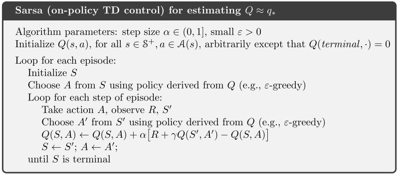
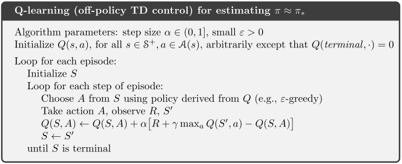

- [Introduction](#introduction)
- [Value-based Methods](#value-based-methods)
  - [Dynamic Programming](#dynamic-programming)
  - [Monte Carlo Method](#monte-carlo-method)
    - [Policy Iteration](#policy-iteration)
    - [Value Iteration](#value-iteration)
  - [Temporal-difference Learning (TD(0))](#temporal-difference-learning-td0)
    - [SARSA](#sarsa)
    - [Q-learning](#q-learning)
  - [Deep Q-learning (DQN)](#deep-q-learning-dqn)
- [Policy-based Methods](#policy-based-methods)
- [discrete state, discrete action: checked](#discrete-state-discrete-action-checked)
- [continuous state, discrete action](#continuous-state-discrete-action)
- [continuous state, continuous action](#continuous-state-continuous-action)
  - [Cross-Entropy Method](#cross-entropy-method)
  - [Policy Gradient Method](#policy-gradient-method)
    - [REINFORCE](#reinforce)
    - [Actor-Critic](#actor-critic)

Introduction
====================

Model-based: agent knows everything (MDP), state, transition probability (grid world):
  - Know transition probability
  - Learn transition probability
  
Model-free: agent learns by experience
  - 

Value-based Methods
=========================

## Dynamic Programming

## Monte Carlo Method

### Policy Iteration

Trajectory: S_0, a_0, r0, s1, a1, r1, ..., s_n, a_n, r_n

### Value Iteration

With model-based assumption, we know every state and transition probabilities (or we can learn transition probabilities). Each state value implies the highest average reward that the agent can get at that state. In order to get the highest reward, we computes the value function by iterating over every state in the enviroment until convergence. The policy is then extracted from the optimal value function by taking actions leading to highest reward in average.

## Temporal-difference Learning (TD(0))

Temporal-difference is a class of model-free algorithm. **Model-free** means that the agent doesn't know anything about the enviroment such as states, transition probability. It will experience the enviroment (data) by itself to find the best way to interact to get highest reward. But how will the agent interact with the enviroment? There are 2 main ways:

- On-policy: data is generated by a given policy. The agent will improve the given policy to obtain optimal policy
- Off-policy: data is generated without a given policy. Instead, the agent will act according to the **value function** or **q function** to generate data. To make sure the agent will explore the enviroment, **$\epsilon$-greedy policy** is often used.

### SARSA

### Q-learning

Q-learning is a off-policy TD algorithm.

## Deep Q-learning (DQN)

Policy-based Methods
=========================

# discrete state, discrete action: checked

# continuous state, discrete action
- Cart Pole, Mountain Car
- Method: Approximation Method by
  -  Linear Function
  -  Neural Network: need a lot data, iid input, target network

# continuous state, continuous action
- Policy - based
- High variance in training steps

## Cross-Entropy Method

## Policy Gradient Method

### REINFORCE

### Actor-Critic

