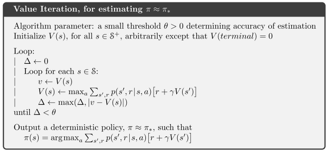

Introduction
====================

Tabular Solution Methods
=========================

## Dynamic Programming

### Policy Iteration

### Value Iteration

With model-based assumption, we know every state and transition probabilities (or we can learn transition probabilities). Each state value implies the highest average reward that the agent can get at that state. In order to get the highest reward, we computes the value function by iterating over every state in the enviroment until convergence. The policy is then extracted from the optimal value function by taking actions leading to highest reward in average.

## Temporal-difference Learning

### SARSA

### Q-learning

Approximation Solution Methods
=========================

## Policy Gradient Method

### REINFORCE

### Actor-Critic

## Deep Q-learning (DQN)
